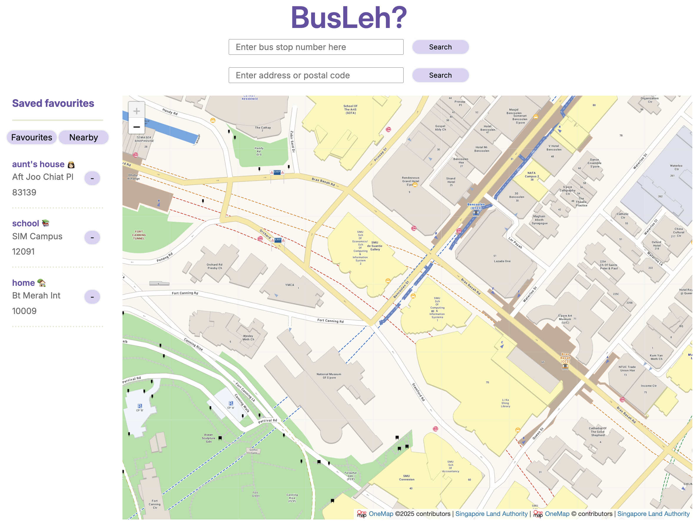
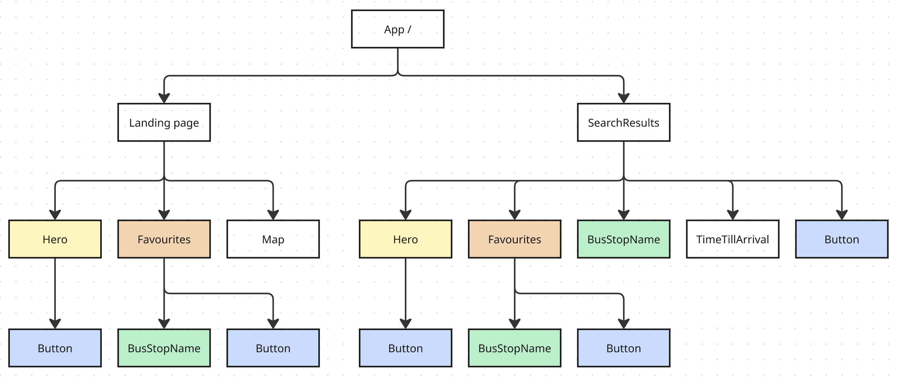
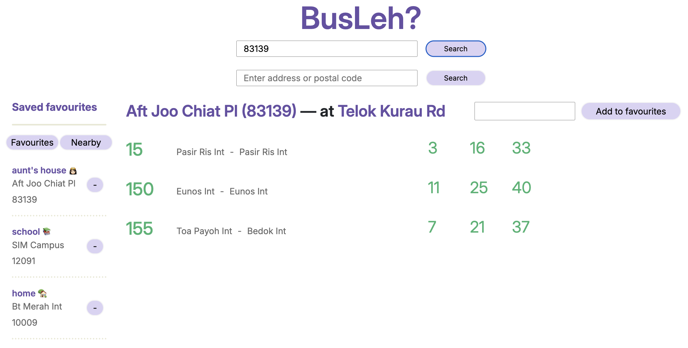
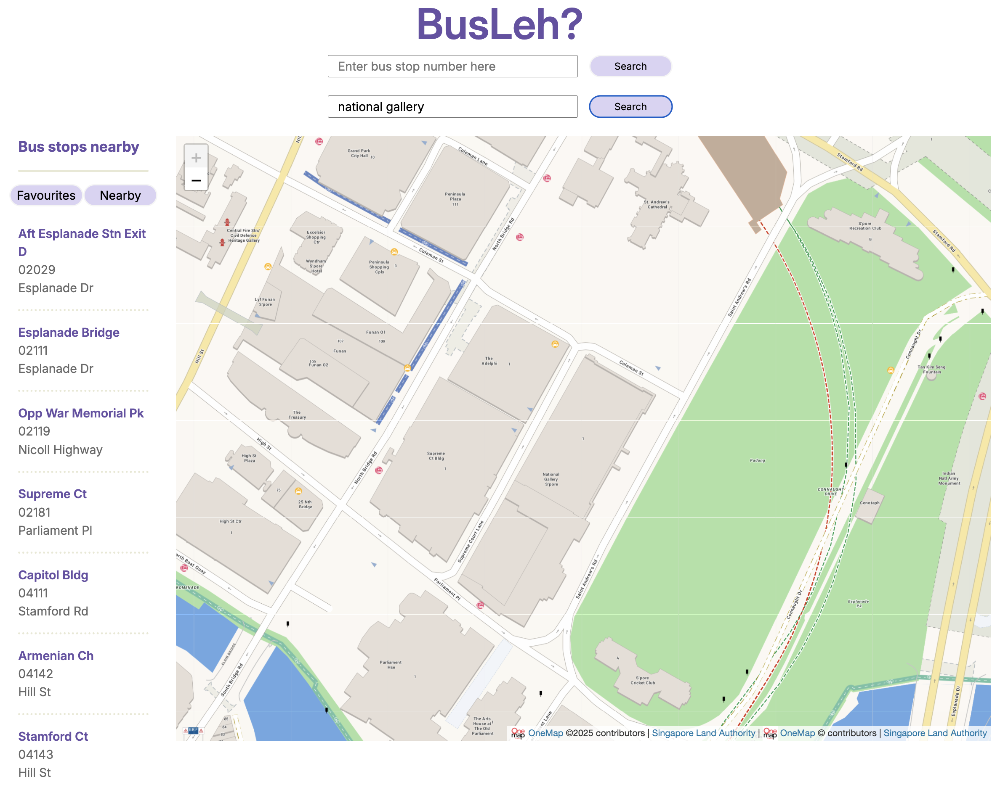

# BusLeh 🚌

---

---

## Table of Contents

- [About The Site](https://github.com/chickenONsteak/project-2-bus_timing?tab=readme-ov-file#about-the-site)
- [Features](https://github.com/chickenONsteak/project-2-bus_timing?tab=readme-ov-file#features-)
- [Tech Stack](https://github.com/chickenONsteak/project-2-bus_timing?tab=readme-ov-file#tech-stack-)
- [App Hierarchy](https://github.com/chickenONsteak/project-2-bus_timing?tab=readme-ov-file#app-hierarchy-)
- [File Structure](https://github.com/chickenONsteak/project-2-bus_timing?tab=readme-ov-file#file-structure-)
- [API References](https://github.com/chickenONsteak/project-2-bus_timing?tab=readme-ov-file#api-references-)
- [Setup & Installation](https://github.com/chickenONsteak/project-2-bus_timing?tab=readme-ov-file#setup--installation-)
- [Preview](https://github.com/chickenONsteak/project-2-bus_timing?tab=readme-ov-file#preview)

---

## About the site

**In a nutshell:** Bus Stop Finder & Arrival Timings.

A single-page application built with **React**, **Vite**, and **TanStack** to search for addresses, locate nearby bus stops within a 500m radius, and manage a list of favourite bus stops using **Airtable** as storage.

This project integrates the **OneMap** Singapore API for geolocation and **LTA** Singapore API for bus stop data.

## Features ✨

- **Bus Stop Search** — Search bus arrival timings by entering bus stop number
- **Address Search** — Search for any address in Singapore and return list of bus stops nearby (within 500m radius) using the Haversine formula.
- **Favourites Management**
  - Save bus stops to Airtable.
  - Retrieve favourites from Airtable.
  - Delete favourites with one click.
- **Toggle View** — Switch between "Nearby" and "Favourites" views.

## Tech Stack 🛠

| Technology   | Purpose                              |
| ------------ | ------------------------------------ |
| React (Vite) | Render UI and component structure    |
| CSS          | styling                              |
| TanStack     | Data fetching and mutation handling  |
| Airtable     | Storage for favourite bus stops      |
| OneMap       | Geocoding and bus stop location data |

## App Hierarchy 🪾

## File Structure 📂

- src/
  - components/
    - LandingPage.jsx — Consists of 3 components: Hero, Favourites, and Map
    - SearchResults.jsx — Display all buses according to bus stop searched
    - Hero.jsx — For search input fields
    - Favourites.jsx — To display nearby bus stops and favourites
    - Map.jsx — To display map
    - BusStopName.jsx — To get the names of bus stops
    - TimeTillArrival.jsx — To get the bus arrival timings

## API References 📜

- **OneMap API:** https://www.onemap.gov.sg/apidocs/
- **LTA API:** https://datamall.lta.gov.sg/content/datamall/en.html
- **Airtable API:** https://airtable.com/developers/web/api/introduction

## Setup & Installation 🚀

1. Clone https://github.com/cheeaun/arrivelah.git repo and follow the README
   1. This is like a proxy to [LTA's DataMall Bus Arrival API](https://datamall.lta.gov.sg/content/datamall/en.html).
   2. Run this proxy in the background.
2. Close this repo
3. Install dependencies
   `npm install`
4. Change the .env.example file to .env with the following:
   `VITE_SERVER=<your Vite proxy server>`
   `VITE_BUS_STOP_NAMES=<json data from https://observablehq.com/@cheeaun/list-of-bus-stops-in-singapore>`
   `VITE_AIRTABLE=<your Airtable key>`
   `VITE_AIRTABLE_KEY=<your Airtable API endpoint>`
5. Run the dev server
   `npm run dev`

## Preview

#### Bus Arrival Timings

#### Bus Stops Nearby

